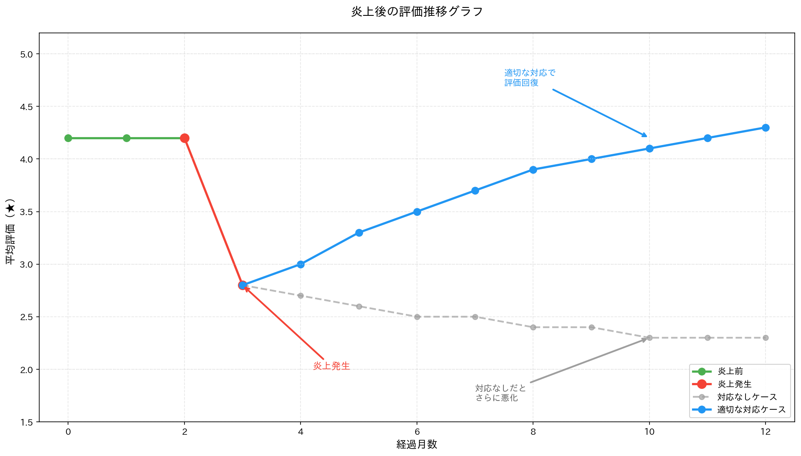

## この記事は誰のため？

この記事は、口コミ炎上・SNS炎上を経験し、「店舗のブランドイメージが損なわれた」「売上が激減した」「評価が1.5まで下がった」という経営者に向けて書かれています。

炎上後の対応を誤ると、ブランドイメージの回復に数年かかります。しかし、適切な戦略を実行すれば、3〜6ヶ月で信頼を回復し、評価を3.5以上に戻すことが可能です。

この記事を読むことで、炎上後のブランド再構築ロードマップ、謝罪の仕方、ポジティブレビュー獲得戦略、評価回復の具体的手順が分かります。

---

## 炎上後のブランド再構築ロードマップ


### フェーズ1: 炎上の鎮火（炎上発生後24時間以内）

炎上発生後24時間以内の目標は、これ以上の炎上拡大を防ぐことです。この初期段階で適切な対応を取ることが、その後の信頼回復を大きく左右します。

まず最初に実施すべきことは、SNS投稿の完全停止です。炎上中は、新規投稿を一切してはいけません。反論や言い訳は、さらに炎上を招くだけです。

次に、公式謝罪文を発表します。ホームページとSNSの両方で謝罪し、「何が問題だったか」「今後どうするか」を明記することが重要です。曖昧な謝罪では、かえって批判を強める結果となります。

問題の原因を特定するための内部調査も即座に開始します。スタッフのミス、システムの不具合、方針の誤りなど、原因を明確にしなければ再発防止策を示すことができません。

メディア対応の準備も必要です。記者会見が必要かどうかを判断し、必要に応じて弁護士やPR会社と連携します。メディア対応を誤ると、炎上が全国規模に拡大するリスクがあります。

**謝罪文のテンプレート**:
```
【お詫びとご報告】

この度、当店の〇〇につきまして、多くのお客様にご不快な思いをさせてしまい、誠に申し訳ございませんでした。

ご指摘いただいた内容を真摯に受け止め、以下の対応を実施いたします。

1. 〇〇の改善
2. スタッフ全員への再教育
3. 再発防止策の徹底

今後、このようなことがないよう、社員一同努力してまいります。

引き続き、皆様に愛される店舗を目指し、サービス向上に努めてまいりますので、何卒ご理解のほど、よろしくお願い申し上げます。

[会社名] 代表取締役 〇〇
```

### フェーズ2: 信頼回復の準備（炎上鎮火後1週間〜1ヶ月）


炎上鎮火後1週間から1ヶ月の期間は、再発防止策を実施し、具体的な改善を示す段階です。

まず最優先で取り組むべきは、再発防止策の実施です。スタッフ研修を行い、マニュアルを全面的に見直し、必要に応じてシステムの改善も行います。口だけの謝罪ではなく、実際に変わったことを証明しなければなりません。

外部監査の実施も信頼回復に効果的です。第三者機関による監査を受け、その結果を公表することで、客観的な改善の証拠を示すことができます。自社の主張だけでは信頼されませんが、第三者の評価があれば説得力が増します。

被害を受けた顧客への個別対応も忘れてはいけません。謝罪と補償を行い、返金やクーポン配布などの具体的な対応を取ります。この対応の誠実さが、SNSで拡散されれば、逆に好印象につながることもあります。

ポジティブな情報発信の準備も並行して進めます。改善内容をSNSやホームページで発信し、プレスリリースも発行します。ただし、発信のタイミングは慎重に見極める必要があります。炎上の記憶が生々しい時期に宣伝めいた投稿をすると、さらに批判を招く危険があります。

### フェーズ3: ポジティブレビュー獲得（炎上鎮火後1ヶ月〜3ヶ月）



炎上鎮火後1ヶ月から3ヶ月の期間は、Googleマップ評価を3.5以上に回復させることを目標とします。

既存顧客、特に常連客へのレビュー依頼が効果的です。ただし「良いレビューを書いて」という誘導的な依頼ではなく、「体験を教えてください」と正直なフィードバックをお願いする形にします。誘導的な依頼は、Googleのポリシー違反となるだけでなく、発覚すれば再び炎上するリスクがあります。

サービス品質の向上も並行して進めます。顧客満足度を高める施策を実施し、口コミで自然に広がるようなサービスを提供することが、持続的な評価回復につながります。一時的な対処療法ではなく、本質的な改善が必要です。

炎上時のネガティブレビューにも、丁寧に返信します。投稿者の怒りを和らげるだけでなく、改善を示すことで、これからレビューを読む閲覧者の印象を変えることができます。「この店は問題を認めて、きちんと改善している」と思ってもらえれば、炎上時のレビューも逆に信頼の証となります。

SNSでのポジティブ情報発信も再開します。改善内容の報告や、顧客からのポジティブな声を紹介することで、徐々にブランドイメージを回復させていきます。

### フェーズ4: ブランド再構築（炎上鎮火後3ヶ月〜6ヶ月）

炎上鎮火後3ヶ月から6ヶ月の期間は、炎上前以上のブランド価値を確立することを目標とします。単に元の状態に戻るのではなく、この経験を成長の機会として捉え、より強いブランドを作ります。

必要に応じてリブランディングを検討します。ロゴや店舗デザインの刷新、新しいコンセプトの打ち出しなど、「変わった」ことを視覚的に示すことも効果的です。ただし、全ての炎上でリブランディングが必要なわけではなく、状況に応じて判断します。

メディア露出も積極的に狙います。ローカルメディアに取材を依頼し、「改善に成功した店舗」としてPRすることで、ポジティブなイメージを広めることができます。炎上を乗り越えた経験は、逆に信頼の証として伝えることもできます。

顧客との関係再構築も重要です。顧客感謝イベントを開催したり、SNSでのコミュニケーションを強化したりすることで、顧客との絆を深めます。炎上で失った信頼は、一方的な発信ではなく、双方向の対話によって取り戻すことができます。

長期的な信頼獲得のために、定期的な第三者監査を継続し、顧客満足度調査を実施して結果を公表します。透明性を保つことが、再び炎上しないための最良の予防策です。

---

> **💡 ヒント**: 炎上対応の初動は[炎上時の危機管理マニュアル](/playbook/crisis-management)、謝罪失敗からの立て直しは[謝罪したのに炎上した対応](/bridge/response-backfired)をご覧ください。エスカレーション対応は[エスカレーション対応一覧](/escalation/)、法的対応は[誹謗中傷への法的対応](/escalation/defamation-handling)もご参照ください。

## 炎上の種類別対応


### 種類1: スタッフの不祥事（暴言、差別発言等）

スタッフの不祥事による炎上では、迅速かつ明確な対応が求められます。まず当該スタッフの処分を行います。処分内容は解雇や減給など、事案の重大性に応じて決定します。

全スタッフへの研修も実施します。一人のミスを個人の問題で終わらせず、組織全体の課題として捉え、再発防止に取り組む姿勢を示すことが重要です。

これらの対応を実施したら、「再発防止のため、〇〇を実施しました」と具体的に公表します。抽象的な謝罪ではなく、具体的なアクションを示すことで信頼回復につながります。

**謝罪文の例**:
```
この度、当店スタッフの不適切な発言により、多くのお客様にご不快な思いをさせてしまい、誠に申し訳ございませんでした。

当該スタッフは厳重に注意し、全スタッフに対して接客マナー研修を実施いたしました。

今後、このようなことがないよう、社員一同努力してまいります。
```

### 種類2: 商品・サービスの欠陥（食中毒、不良品等）

商品やサービスの欠陥による炎上では、まず原因究明を行い、その結果を公表します。隠蔽すると、発覚した際にさらに大きな炎上を招きます。

被害者への補償も速やかに実施します。金銭的な補償だけでなく、誠意ある対応が求められます。

再発防止策として、衛生管理の強化や品質検査の徹底など、具体的な改善策を実施します。口先だけの約束ではなく、実際にシステムを変更することが必要です。

**謝罪文の例**:
```
この度、当店の商品につきまして、〇〇の不具合があり、お客様にご迷惑をおかけしましたこと、深くお詫び申し上げます。

原因は〇〇であることが判明し、再発防止のため〇〇を実施いたしました。

今後、品質管理を徹底し、安心してご利用いただける店舗を目指してまいります。
```

### 種類3: 虚偽広告・誇大表現（おとり物件、合格実績詐欺等）

虚偽広告や誇大表現による炎上では、まず該当する広告を直ちに削除または訂正します。広告を放置すると、景品表示法違反で行政処分を受けるリスクがあります。

広告審査体制を強化し、今後同様の問題が発生しないようにシステムを構築します。チェック体制の不備が原因であることを認め、改善を示します。

必要に応じて消費者庁や行政への報告も行います。自主的に報告することで、誠実な対応として評価されることもあります。

**謝罪文の例**:
```
この度、当社の広告表現につきまして、誤解を招く内容があり、お客様にご迷惑をおかけしましたこと、深くお詫び申し上げます。

該当の広告は削除し、今後は広告審査体制を強化いたします。

皆様に正確な情報を提供できるよう、社員一同努力してまいります。
```

---

## ポジティブレビュー獲得戦略


### 戦略1: レビュー依頼のタイミング

レビュー依頼の成功は、タイミングが全てです。最適なタイミングとして、まずサービス提供直後が挙げられます。満足度が高い状態で依頼すれば、ポジティブなレビューを書いてもらいやすくなります。

顧客が感動した瞬間も絶好のタイミングです。サプライズ対応後など、「この店のことを誰かに教えたい」という気持ちが高まっている時に依頼すると効果的です。

リピーター客が再来店した時も良いタイミングです。複数回利用しているということは、基本的に満足している証拠ですから、レビューを依頼しやすい状況です。

逆に絶対に避けるべきは、炎上直後のレビュー依頼です。これは完全に逆効果で、「評価操作をしようとしている」と批判され、さらに炎上が拡大します。また、何度もしつこく依頼するのも避けるべきです。一度断られたら、それ以上は追いかけないことが大切です。

### 戦略2: レビュー依頼の方法

レビュー依頼の方法には、いくつかの推奨される手法があります。

まず口頭での依頼が最も自然です。「もしよろしければ、Googleマップにレビューをお願いできますか？」と丁寧に聞き、QRコードを提示すれば、その場で簡単にレビューを書いてもらえます。

レシートにQRコードを印刷する方法も効果的です。レビューページへの直リンクを用意し、「ご意見・ご感想をお聞かせください」と記載しておけば、後から気が向いた時に書いてもらえる可能性があります。

メールやLINEで依頼する方法もあります。「先日はご来店ありがとうございました。ぜひ体験をお聞かせください」というメッセージを送ることで、レビュー投稿を促すことができます。

一方、絶対に避けるべき方法もあります。金銭や割引と引き換えにレビューを依頼するのは、ステマややらせレビューとみなされ、発覚すれば大きな炎上につながります。また「良いレビューを書いて」という誘導的な依頼も、プラットフォームのポリシー違反です。あくまで「正直な感想を教えてください」というスタンスを貫くことが重要です。

### 戦略3: サービス品質の向上

レビューは依頼するだけでは集まりません。顧客が自発的に「この体験を誰かに伝えたい」と思うようなサービスを提供することが、最も効果的なレビュー獲得戦略です。

期待を超えるサービスは、レビューを書きたくなる大きな動機になります。サプライズや無料サービスなど、想定していなかった良い体験があると、人はそれを共有したくなるものです。

心温まる対応も効果的です。手書きのメッセージカードなど、ちょっとした気遣いが、顧客の心に残り、レビューという形で返ってくることがあります。

問題が起きた時の誠実な対応も、実は高評価レビューにつながります。クレームを丁寧に解決することで、「最初は不満だったが、対応が素晴らしかった」というレビューを書いてもらえることがあります。

具体例として、飲食店では誕生日プレートの無料サービス、美容室では仕上がりに満足できなかった場合の無料やり直し、ホテルではチェックアウト時のサンキューレターなどが挙げられます。これらはコストをかけずに実施できる施策です。

---

## Googleマップ評価回復の具体的ステップ

### ステップ1: 現状分析

まず現在の状況を正確に把握することから始めます。確認すべき指標として、平均評価（現在の星の数）、レビュー数（総数）、ネガティブレビューの割合、最近のレビュー（直近30日）があります。

例えば、平均評価が1.5★、レビュー数が100件、ネガティブレビュー（1〜2★）が60件、ポジティブレビュー（4〜5★）が20件という状況を想定してみます。この数字を把握することで、どれだけの改善が必要かが見えてきます。

### ステップ2: 目標設定

現状分析ができたら、具体的な目標を設定します。例えば、3ヶ月後に平均評価3.0以上、6ヶ月後に平均評価3.5以上という目標を立てます。

必要なポジティブレビュー数を計算してみましょう。現在の平均評価が1.5、レビュー数が100件の場合、現在の総合点数は1.5×100=150点です。目標が平均3.0、レビュー数150件（新規50件獲得）だとすると、必要な総合点数は3.0×150=450点となります。新規レビューで必要な点数は450-150=300点、つまり新規レビューの平均は300÷50=6点が必要です。これは5★レビューを50件獲得する必要があることを意味します。

現実的な目標としては、5★レビューを毎月15件獲得し、3ヶ月で45件獲得することで平均評価2.9に回復させることが可能です。

### ステップ3: ネガティブレビューへの丁寧な返信

炎上時のレビューにも、誠実に返信します。返信の目的は2つあります。1つ目は投稿者への謝罪で、投稿者の怒りを和らげることです。2つ目は閲覧者への印象改善で、「改善している店舗だ」と思ってもらうことです。

返信テンプレートとしては、まず謝罪し、改善に取り組んでいることを伝え、再来店を促す流れが効果的です。

```
この度はご不快な思いをさせてしまい、誠に申し訳ございませんでした。

ご指摘いただいた内容を真摯に受け止め、スタッフ全員で改善に取り組んでおります。

もしよろしければ、改めてご来店いただけますと幸いです。スタッフ一同、心よりお待ちしております。

[店舗名] 店長 〇〇
```

### ステップ4: ポジティブレビュー獲得施策


ポジティブレビュー獲得のための具体的施策として、まずレビュー依頼QRコードをレシートに印刷する方法があります。顧客が帰宅後に思い出して書いてくれる可能性が高まります。

常連客に口頭で依頼することも効果的です。顔見知りの関係であれば、快く協力してくれる可能性が高いです。

Googleマイビジネスの「短縮URL」を活用すれば、レビューページへの直リンクを簡単に共有できます。この機能を使うことで、顧客がレビューを書くまでの手間を減らせます。

そして何より重要なのが、顧客満足度を高めるサービス改善です。レビュー依頼のテクニックよりも、本質的なサービス品質の向上が、長期的には最も効果的です。

目標としては、毎月15件の5★レビューを獲得し、3ヶ月で45件獲得することを目指します。

---

## 炎上後のSNS運用

### SNS再開のタイミング

SNS再開の目安は、炎上鎮火後1週間から1ヶ月です。再発防止策を実施し、具体的な改善を示せる状態になってから再開することが重要です。焦って早く再開すると、さらに批判を招く危険があります。

再開時の投稿内容は、謝罪と改善への取り組みを簡潔に伝える形が適切です。

```
【営業再開のお知らせ】

皆様にはご心配をおかけしましたこと、深くお詫び申し上げます。

この度の件を真摯に受け止め、スタッフ全員で改善に取り組んでまいりました。

本日より、通常営業を再開いたします。

引き続き、皆様に愛される店舗を目指し、サービス向上に努めてまいりますので、何卒よろしくお願い申し上げます。

[店舗名]
```

### 炎上後のSNS投稿ルール

炎上後のSNS運用では、やるべきことと避けるべきことを明確に区別する必要があります。

やるべきこととしては、ポジティブな情報発信が挙げられます。新メニューやイベントなど、前向きな話題を投稿することで、徐々にイメージを回復させます。また、顧客の声の紹介（ポジティブなもの）や、改善内容の報告も効果的です。

一方、絶対に避けるべきは、炎上に関する言い訳、批判者への反論、過去の炎上の蒸し返しです。これらは確実に再炎上を招きます。炎上については触れず、前を向いた発信を心がけることが重要です。

---

## ブランド再構築の成功事例


### 事例1: 飲食店の食中毒炎上からの回復

ある飲食店では、食中毒で10名の顧客が被害を受け、SNSで拡散された結果、Googleマップ評価が1.2まで低下しました。

店側は直ちに営業を停止し、保健所の調査に全面的に協力しました。公式謝罪文を発表するとともに、衛生管理システムを全面的に刷新し、HACCP（危害分析重要管理点）を導入しました。さらに第三者機関による衛生監査を実施し、その結果を公表することで透明性を示しました。営業再開後は、レビュー依頼を徹底し、改善した状態を顧客に体験してもらいました。

その結果、6ヶ月で平均評価が3.8に回復しました。さらに「改善に成功した店舗」としてメディアに取り上げられ、来客数は炎上前の1.5倍にまで増加しました。危機を成長の機会に変えた好例です。

### 事例2: 不動産会社のおとり物件炎上からの回復

ある不動産会社では、おとり物件の大量掲載が発覚し、Googleマップ評価が1.5まで低下、業務停止処分（3ヶ月）を受けました。

会社は公式謝罪文を発表し、物件情報を全面的に見直しました。広告審査体制を導入して第三者チェックを義務化し、顧客対応マニュアルも刷新しました。業務再開後は、誠実な対応を徹底し、おとり物件を完全に排除しました。

1年で平均評価が3.5に回復し、「おとり物件ゼロ宣言」を打ち出すことでブランド価値が向上しました。炎上をきっかけに、業界内でも信頼される企業へと生まれ変わりました。

---

## 次のステップ

ブランド再構築をさらに詳しく知りたい方は、以下の記事もご参照ください。

- [口コミ炎上時の緊急対応マニュアル｜24時間以内にすべきこと](/playbook/crisis-management)
- [口コミ返信の外注・代行サービス比較｜料金相場と選び方のポイント](/bridge/response-outsourcing)
- [Googleマイビジネス最適化（MEO）完全ガイド｜上位表示と評価向上の戦略](/bridge/meo-optimization)

---

## 免責

本記事は一般的な情報提供を目的としており、個別の法的助言ではありません。炎上対応は、個別の状況により異なります。重大な炎上の場合は、PR会社・弁護士にご相談ください。
