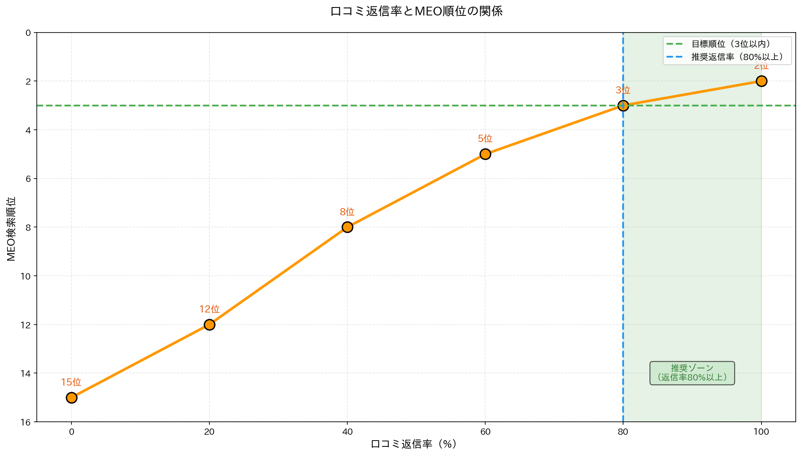

## この記事は誰のため？

この記事は、「Googleマップで検索しても自分の店が出てこない」「競合店ばかり上位表示される」「Googleマップからの集客を増やしたい」という地域ビジネスの経営者に向けて書かれています。

MEO（Map Engine Optimization / ローカルSEO）を実施すれば、Googleマップ検索で上位3位以内（ローカルパック）に表示され、来店数を2〜5倍に増やすことが可能です。

この記事を読むことで、Googleマイビジネスの最適化方法、口コミ評価の向上戦略、ローカルSEOの具体的手順が分かります。

---

## MEOとは？


### MEO（Map Engine Optimization）の定義

MEOとは、Googleマップ検索で上位表示されるための最適化施策です。SEOとの違いを理解することが重要で、SEOはGoogle検索結果でウェブサイトを上位表示させる施策であるのに対し、MEOはGoogleマップ検索でGoogleマイビジネスを上位表示させる施策です。

### MEOが重要な理由

MEOが重要な理由は、統計データが明確に示しています。Googleの調査によると、ローカル検索の76%は24時間以内に来店につながります。また、モバイル検索での「近くの〇〇」という検索は年々増加しており、ローカルパック（上位3件）のクリック率は44%にも達します。

効果として、来店数の増加、新規顧客の獲得、広告費の削減（無料で上位表示）が期待できます。特に地域密着型ビジネスにとって、MEOは最もコストパフォーマンスの高い集客手段の一つです。

---

## Googleマップ上位表示の仕組み


### Googleのランキング要因（公式発表）

Google公式ガイドラインによると、Googleマップの順位は3つの要素で決まります。

#### 1. 関連性（Relevance）

関連性とは、検索キーワードと店舗情報の一致度を示します。最適化方法として、Googleマイビジネスのカテゴリ設定を正確に行い、ビジネス説明欄にキーワードを含め、商品・サービス情報を詳細に記載します。

例えば「新宿 イタリアン」という検索に対しては、カテゴリを「イタリアンレストラン」と正確に設定することが重要です。単に「レストラン」では曖昧すぎて、関連性のスコアが下がります。

#### 2. 距離（Distance）

距離とは、検索者の現在地から店舗までの物理的な距離です。最適化方法として、住所を正確に登録し、NAP（Name, Address, Phone）を統一することが重要です。

注意点として、距離そのものは変えられないため、関連性と知名度のスコアを高めることで補う必要があります。

#### 3. 知名度（Prominence）

知名度とは、店舗の知名度や評判を示します。最適化方法として、口コミ数・評価を増やし、被リンクを増やし（ウェブサイトへのリンク）、SNSでの言及を増やすことが重要です。

Google公式発表によると、この要素が最も重要です。つまり、いくら正確な情報を登録しても、知名度が低ければ上位表示は困難です。

---

## Googleマイビジネス最適化の具体的手順


### ステップ1: Googleマイビジネスの登録・認証

まずGoogleマイビジネスにアクセスし、ビジネス名・住所・電話番号を入力します。次にカテゴリを選択し、オーナー確認（郵送・電話・メール）を行います。

登録自体は5分程度で完了しますが、オーナー確認には1〜2週間かかることがあるため、早めに手続きを開始することをおすすめします。

### ステップ2: ビジネス情報の最適化

ビジネス情報の最適化は、MEOで最も重要なステップの一つです。以下の項目を丁寧に設定します。

#### カテゴリの設定

メインカテゴリでは、最も重要な業種を1つ選択します。例えば「イタリアンレストラン」「美容室」「歯科医院」などです。

追加カテゴリは最大9個まで追加可能で、メインを「イタリアンレストラン」とした場合、追加で「ピザ屋」「パスタレストラン」などを設定できます。カテゴリは具体的であればあるほど、関連性のスコアが高まります。

#### ビジネス説明

ビジネス説明欄には、店舗の特徴（こだわり、強み）、ターゲット顧客（ファミリー向け、ビジネスマン向け等）、主要サービス（ランチ、ディナー、テイクアウト等）を記載します。

文字数は750文字まで入力可能なので、できるだけ埋めることが重要です。情報が豊富であるほど、Googleはその店舗を正確に理解でき、適切な検索結果に表示してくれます。

**例**:
```
当店は、本場イタリアで修行したシェフが手がける本格イタリアンレストランです。石窯で焼き上げるナポリピザと、自家製パスタが自慢です。

ランチタイムは、サラダ・ドリンク付きのお得なセットメニューをご用意。ディナーは、記念日や接待にもご利用いただける個室席もございます。

お子様連れのファミリーも大歓迎。キッズメニューもご用意しております。

〇〇駅から徒歩3分。駐車場完備。
```

#### 営業時間

営業時間の設定も非常に重要です。通常営業時間に加えて、特別営業時間（祝日、年末年始等）や臨時休業も正確に設定します。

重要性として、営業時間が正確でないと上位表示されにくくなります。Googleは正確な情報を提供しているビジネスを優先的に表示するため、営業時間の管理は怠らないようにしましょう。

#### 写真の追加


写真の追加は、顧客の関心を引く重要な要素です。外観は5枚以上、内観は10枚以上、料理・商品は20枚以上、スタッフは3枚以上、そしてロゴを必ずアップロードします。

写真のポイントとして、高画質（1080px以上推奨）で、明るく鮮明な写真を選びます。また、定期的に更新（月1回以上）することで、活発に運営されているビジネスであることをアピールできます。

#### 商品・サービス

商品・サービス情報として、主要メニュー・サービス、価格、説明文を詳細に記載します。

飲食店の例として、以下のように記載します。

```
商品名: マルゲリータ
価格: 1,500円
説明: モッツァレラチーズとバジルのシンプルなピザ。石窯で焼き上げた本格ナポリピザです。
```

具体的な商品情報を充実させることで、顧客の来店意欲を高めることができます。

### ステップ3: NAP統一（Name, Address, Phone）

NAP統一とは、店舗名・住所・電話番号を、全てのウェブ上で統一することです。これはMEOにおいて非常に重要な要素です。

統一すべき場所として、Googleマイビジネス、公式ウェブサイト、食べログやホットペッパー等の口コミサイト、SNS（Facebook、Instagram等）、イエローページや地域ポータルサイトがあります。

NG例として、Googleマイビジネスで「新宿イタリアンレストラン ラ・フェリーチェ」、公式サイトで「イタリアンレストラン ラ・フェリーチェ 新宿店」、食べログで「ラ・フェリーチェ」とバラバラに記載することです。

OK例は、全て「ラ・フェリーチェ 新宿店」で統一することです。わずかな表記の違いでも、Googleは別の店舗と認識してしまう可能性があります。

### ステップ4: 口コミ獲得・評価向上

口コミの重要性は非常に高く、口コミ数が多いほど上位表示されやすく、評価（星の数）が高いほどクリック率が上がります。

口コミ獲得方法として、レシートにQRコードを印刷する、来店時に口頭で依頼する、Googleマイビジネスの短縮URLを活用するなどがあります。

目標として、月10件以上の新規レビュー獲得と、平均評価4.0以上を目指しましょう。継続的にレビューが投稿されていることが、Googleからの評価を高めます。

### ステップ5: 投稿機能の活用

投稿機能とは、Googleマイビジネスで最新情報を発信できる機能です。この機能を活用することで、検索結果での露出を増やせます。

投稿すべき内容として、新メニュー・新商品の紹介、キャンペーン・イベント情報、営業時間の変更、臨時休業のお知らせなどがあります。

投稿頻度は週1回以上が推奨されます。効果として、最新情報が検索結果に表示され、エンゲージメントが高まることで上位表示されやすくなります。定期的な投稿は、活発に運営されているビジネスであることの証明にもなります。

---

> **💡 ヒント**: 口コミ獲得は[ポジティブレビュー生成](/playbook/review-generation)、口コミ返信は[軽度クレーム対応一覧](/mild-response/)をご覧ください。監視ツールは[口コミ監視ツール比較](/bridge/monitoring-tools)、外注サービスは[口コミ返信外注](/bridge/response-outsourcing)もご参照ください。

## ローカルSEOの実践テクニック


### テクニック1: ローカルキーワードの最適化

ローカルキーワードとは、地域名と業種を組み合わせたキーワードです。例えば「新宿 イタリアン」「渋谷 美容室」「池袋 歯科」などが該当します。

最適化方法として、Googleマイビジネスのビジネス説明にこれらのキーワードを自然な形で含めます。また、公式サイトのタイトルタグ・メタディスクリプションにも含め、ブログ記事でローカル情報を発信することで、ローカル検索での露出を高めることができます。

### テクニック2: サイテーション獲得

サイテーションとは、他サイトでの店舗名・住所・電話番号の言及のことです。被リンクがなくても、店舗情報が言及されているだけで効果があります。

獲得方法として、食べログやホットペッパー等の口コミサイトに登録し、地域ポータルサイトや業界団体のディレクトリにも登録します。

効果として、サイテーションが多いほど、Googleが「知名度が高い」と判断し、上位表示されやすくなります。多くのサイトで言及されていることが、信頼性の証となります。

### テクニック3: ローカルリンク獲得

ローカルリンクとは、地域のウェブサイトからのリンクです。地域密着型のリンクは、MEOにおいて特に価値があります。

獲得方法として、地域ブログへの取材依頼、地域イベントへの協賛、商工会議所・観光協会のサイトへの掲載などがあります。

効果として、被リンクが増えるとSEO・MEO両方で有利になります。特に地域に根ざしたサイトからのリンクは、ローカル検索で強い影響力を持ちます。

---

## MEO対策の成功事例



### 事例1: 飲食店（新宿）

ある新宿のイタリアンレストランでは、施策前はGoogleマップ検索「新宿 イタリアン」で20位圏外、月間来店数は300人という状況でした。

実施した施策として、Googleマイビジネス最適化（写真50枚追加、ビジネス説明充実）、口コミ獲得キャンペーン（月20件獲得）、週1回の投稿を行いました。

施策後3ヶ月で、Googleマップ検索「新宿 イタリアン」で3位（ローカルパック表示）に上昇し、月間来店数は800人（2.7倍）に増加しました。MEO施策により、広告費をかけずに集客を大幅に増やすことに成功した事例です。

### 事例2: 美容室（渋谷）

ある渋谷の美容室では、施策前はGoogleマップ検索「渋谷 美容室」で50位圏外、平均評価は3.2という状況でした。

実施した施策として、NAP統一（全サイトで店舗名を統一）、口コミ返信を全件実施、サイテーション獲得（食べログ、ホットペッパービューティー等10サイトに登録）を行いました。

施策後6ヶ月で、Googleマップ検索「渋谷 美容室」で1位を獲得し、平均評価は4.5に向上しました。一貫性のある情報発信と丁寧な口コミ対応が、大きな成果につながった事例です。

---

## よくある失敗と対策

MEO対策を行う際によくある失敗と、その対策を紹介します。

### 失敗1: カテゴリの誤設定

失敗例として、イタリアンレストランなのにカテゴリが「レストラン」と曖昧に設定されているケースがあります。これでは関連性のスコアが下がってしまいます。

対策として、最も具体的なカテゴリを選択することです。「レストラン」ではなく「イタリアンレストラン」を選ぶだけで、大きな違いが生まれます。

### 失敗2: 写真が少ない

失敗例として、外観写真1枚のみという店舗があります。これでは顧客に店舗の魅力が伝わりません。

対策として、最低30枚以上の写真をアップロードすることです。多様な写真があることで、顧客の興味を引き、クリック率が向上します。

### 失敗3: 口コミに返信しない

失敗例として、50件の口コミがあるのに返信が0件という店舗があります。これでは顧客からの評価が低くなります。

対策として、全ての口コミに返信することです。ポジティブ・ネガティブ両方に丁寧に返信することで、顧客との関係性が深まり、新規顧客にも良い印象を与えられます。

### 失敗4: 投稿を全くしない

失敗例として、Googleマイビジネスを登録したきり、完全に放置している店舗があります。これでは「活発なビジネス」とは認識されません。

対策として、週1回は投稿することです。定期的な投稿により、検索結果での露出が増え、上位表示されやすくなります。

---

## 次のステップ

MEO対策をさらに詳しく知りたい方は、以下の記事もご参照ください。

- [口コミ監視ツール比較・導入ガイド｜自動通知・レポート機能の選び方](/bridge/monitoring-tools)
- [口コミ返信の外注・代行サービス比較｜料金相場と選び方のポイント](/bridge/response-outsourcing)
- [炎上後のブランド再構築戦略｜口コミ炎上から信頼回復する完全ロードマップ](/bridge/brand-rebuilding-strategy)

---

## 免責

本記事は一般的な情報提供を目的としており、Googleの検索アルゴリズムは常に変動します。最新情報は、Google公式ガイドラインをご確認ください。
