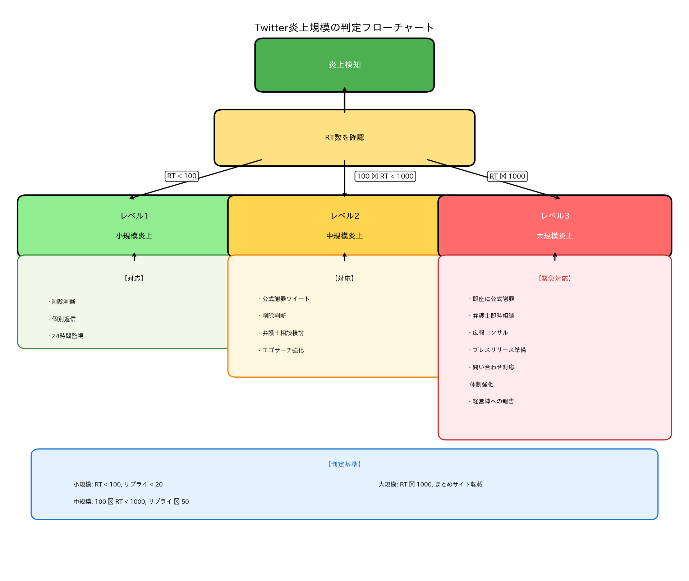
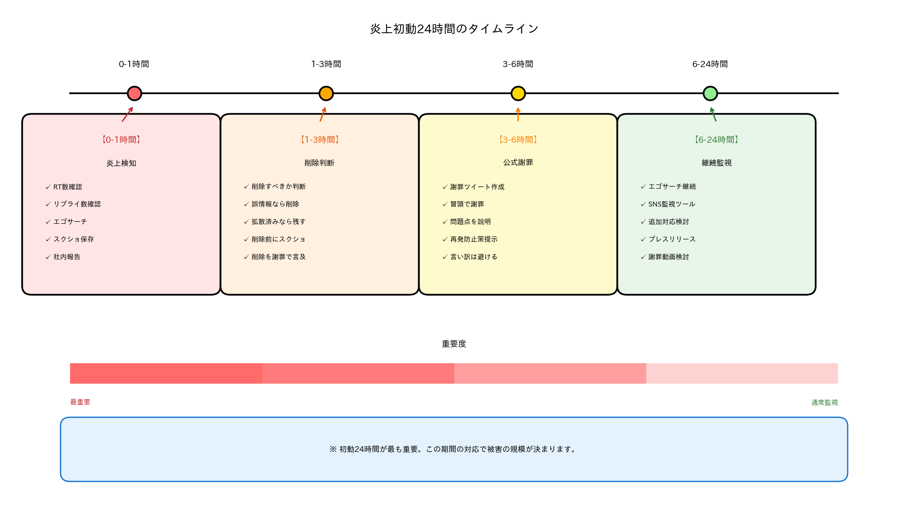
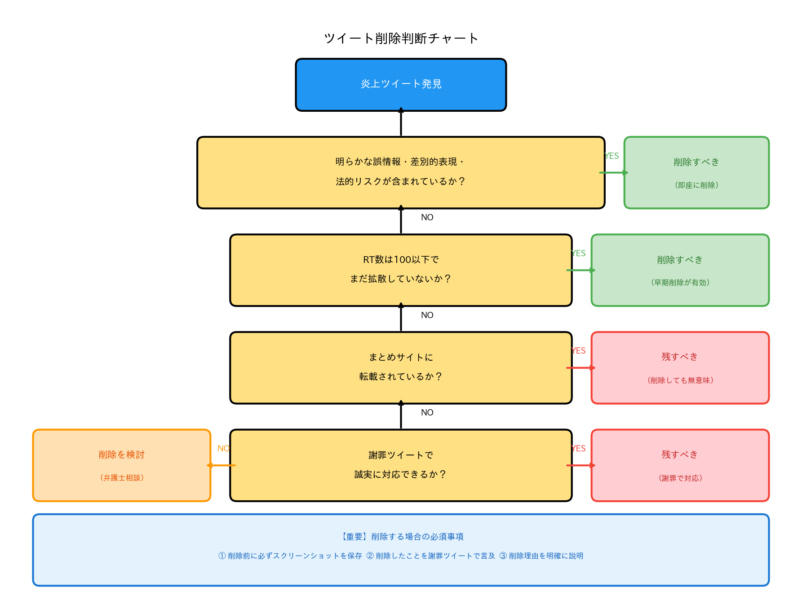
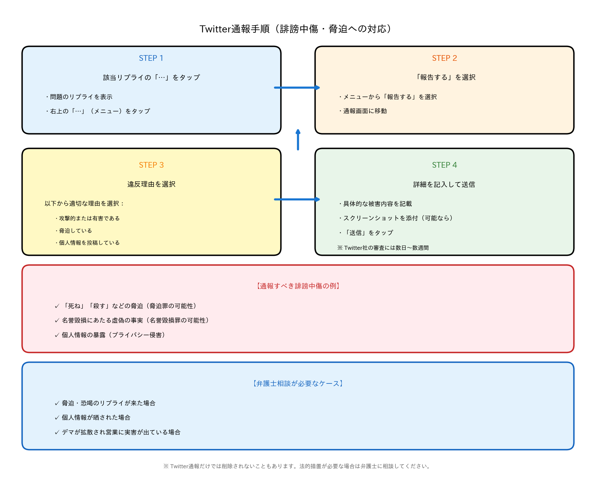
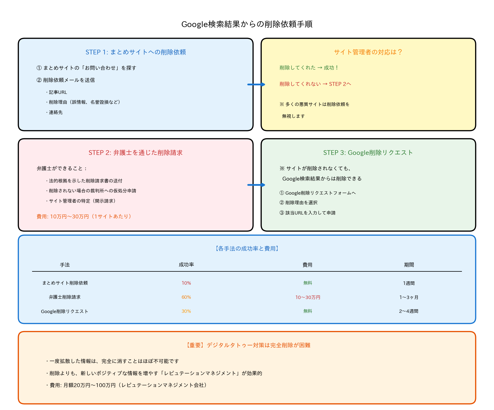
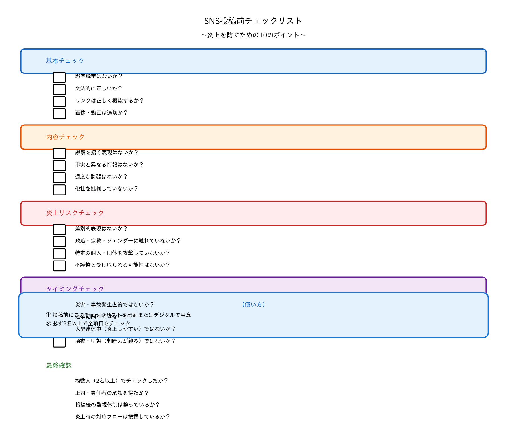

## この記事は誰のため？

この記事は、Twitterで炎上してしまった企業アカウント・店舗アカウント運営者に向けて書かれています。

Twitterは拡散力が非常に高く、1つのツイートが数万RTされると、収拾がつかなくなります。炎上の初動24時間で適切な対応を取らないと、まとめサイト、ニュースサイトに転載され、永久に残るデジタルタトゥーになります。

この記事を読むことで、Twitter炎上の初動対応フロー、謝罪ツイートの書き方、削除すべきか残すべきかの判断基準、弁護士介入のタイミングが分かります。

---

## Twitter炎上の段階と対応レベル



炎上の規模によって、対応レベルを変える必要があります。

### 炎上レベル1: 小規模炎上（RT 100以下）

RTが100以下、リプライ（返信）が20件以下で、まとめサイトに転載されていない状態です。

この段階では、ツイートを削除するか判断し、リプライに個別返信（可能であれば）して、様子を見ます。24時間監視を継続してください。

### 炎上レベル2: 中規模炎上（RT 100〜1,000）

RTが100〜1,000、リプライが50件以上で、インフルエンサーが言及し始める段階です。

この段階では、公式謝罪ツイートを投稿し、炎上ツイートを削除するか判断し、弁護士に相談を検討してください。

### 炎上レベル3: 大規模炎上（RT 1,000以上）

RTが1,000以上で、まとめサイト・ニュースサイトに転載され、Yahoo!ニュースのトレンド入りした状態です。

この段階では、即座に公式謝罪文を投稿し、弁護士・広報コンサルタントに相談し、プレスリリースを準備し、電話・メール問い合わせ対応体制を強化する必要があります。

---

## 炎上初動24時間の対応フロー



炎上を検知してから24時間以内の対応が、被害を最小化する鍵です。

### 【0〜1時間】炎上検知と情報収集

まず炎上の規模を確認します。RT数はツイート詳細を確認し、100以下なら小規模、100-1,000なら中規模、1,000以上なら大規模と判断します。リプライ数はリプライ欄を確認し、20以下なら小規模、50以上なら中規模、100以上なら大規模です。

エゴサーチでは「店舗名 炎上」で検索し、ツイート10件以下なら小規模、50件以上なら中規模、100件以上なら大規模と判断します。まとめサイトはGoogleで「店舗名」検索し、転載なしなら小規模、1サイトなら中規模、複数サイトなら大規模です。

次に、スクリーンショットを保存します。炎上ツイート、リプライ、引用RTのスクリーンショットをすべて保存してください。削除後も証拠として残り、弁護士に相談する際の資料になります。また、後から「何が問題だったか」分析できます。

そして、社内・関係者に報告します。経営者・店長、広報担当者、弁護士（顧問弁護士がいる場合）、SNS運用担当者全員に即座に報告してください。

### 【1〜3時間】削除判断と初動対応



炎上ツイートを削除すべきかどうかを判断します。明らかな誤情報を発信した場合、差別的表現が含まれていた場合、法的リスクがある表現だった場合、RTが100以下でまだ拡散していない場合は削除すべきです。

一方、既にRT 1,000以上で削除しても広まっている場合、削除すると「証拠隠滅」と批判される場合、まとめサイトに転載済みの場合、謝罪ツイートで対応する方が誠実な場合は削除すべきではありません。

削除する場合は、必ず削除前にスクリーンショットを保存し、ツイートを削除してから、削除したことを謝罪ツイートで言及してください。

謝罪ツイート例は以下の通りです。

```
先ほど投稿したツイートにつきまして、不適切な表現が含まれていたため、削除いたしました。

ご不快な思いをさせてしまった皆様に、深くお詫び申し上げます。

今後はこのようなことがないよう、投稿前の確認を徹底いたします。

[アカウント名]
```

### 【3〜6時間】公式謝罪ツイート作成

謝罪ツイートは、冒頭で謝罪し、何が問題だったか説明し、再発防止策を提示し、今後の対応を明記する構成で書きます。

```
【お詫び】

本日投稿したツイートにおきまして、不適切な表現があり、多くの皆様にご不快な思いをさせてしまったこと、深くお詫び申し上げます。

〇〇という表現は、配慮に欠けるものであり、即座に削除いたしました。

今後はSNS投稿前の複数人チェック体制を導入し、再発防止に努めてまいります。

重ねてお詫び申し上げます。

[店舗名/企業名]
```

NG表現として、「本意ではなかったのですが、〇〇という意図で投稿したところ、誤解を招いてしまい…」と300文字以上の説明をする言い訳は避けてください。「言い訳ばかり」と批判され、さらに炎上します。

「担当者が誤って投稿してしまいました」という責任転嫁も避けてください。「担当者のせいにしている」と批判されます。企業としての責任を明確にしてください。

謝罪ツイートで削除したことに言及しないのも避けてください。「都合の悪いツイートを削除して、謝罪だけしている」と批判されます。

### 【6〜24時間】継続監視と追加対応

エゴサーチを継続し、「店舗名 炎上」「店舗名 謝罪」「アカウント名」などのキーワードで検索します。Yahoo!リアルタイム検索、Twitterの検索機能、SNS監視ツール（Brandwatch、Hootsuite等）を活用してください。

謝罪ツイート後も炎上が収まらない場合、追加対応を検討します。公式サイトで謝罪文を掲載し、プレスリリースとして配信することや、代表者が謝罪動画を投稿すること、弁護士を通じて声明を発表することを検討してください。

---

> **💡 ヒント**: 軽度のクレームへの対応は[軽度クレーム対応一覧](/mild-response/)、エスカレーション対応は[エスカレーション対応一覧](/escalation/)をご覧ください。プラットフォーム別対応の他の記事は[プラットフォーム別対応一覧](/platform-specific/)で確認できます。炎上対応は[炎上時の危機管理マニュアル](/playbook/crisis-management)、Instagram炎上は[Instagram炎上対応](/platform-specific/instagram-response)もご参照ください。

## リプライ（返信）への対応方法

炎上ツイートに大量のリプライが来た場合の対応方法です。

建設的な意見・質問や、謝罪を受け入れてくれたリプライには返信すべきですが、誹謗中傷・攻撃的なリプライ、議論を吹っかけてくるリプライ、揚げ足取りのリプライには返信すべきではありません。攻撃的なリプライに返信すると、必ず炎上が拡大します。

### リプライ返信テンプレート（建設的な意見）

```
貴重なご意見をいただき、ありがとうございます。

ご指摘いただいた点、真摯に受け止め、改善に努めてまいります。

今後とも何卒よろしくお願いいたします。

[アカウント名]
```

### リプライ返信テンプレート（謝罪受け入れ）

```
温かいお言葉をいただき、ありがとうございます。

今後はこのようなことがないよう、スタッフ一同、気を引き締めてまいります。

引き続き、何卒よろしくお願いいたします。

[アカウント名]
```

---

## 誹謗中傷リプライへの対応



炎上すると、誹謗中傷・脅迫のリプライが大量に来ることがあります。

「死ね」「殺す」という脅迫・名誉毀損は、脅迫罪、名誉毀損罪の可能性があります。個人情報の暴露はプライバシー侵害にあたります。デマの拡散は名誉毀損罪、差別的表現はヘイトスピーチにあたります。これらは必ずTwitterに通報してください。

Twitter通報の手順は、該当リプライの「…」をタップし、「報告する」を選択し、違反理由を選択（「攻撃的または有害である」など）し、詳細を記入して送信します。通報しても、すぐに削除されるとは限りません。Twitter社の審査には数日〜数週間かかることがあります。

脅迫・恐喝のリプライが来た場合、個人情報が晒された場合、デマが拡散され営業に実害が出ている場合、複数のアカウントから組織的な攻撃を受けている場合は、弁護士に相談してください。

---

## まとめサイト・ニュースサイトへの転載対策



炎上がまとめサイトやニュースサイトに転載されると、Google検索で永久に残ります。

まとめサイトへの削除依頼は、まずサイト管理者に連絡します。まとめサイトの「お問い合わせ」から削除依頼を送ってください。

```
件名: 記事削除依頼

〇〇まとめサイト 管理者様

貴サイトに掲載されている以下の記事につきまして、削除をお願いいたします。

【記事URL】
https://example.com/article/12345

【削除理由】
当該記事には、当社に関する誤った情報が含まれており、名誉毀損にあたる可能性があります。

つきましては、早急に記事の削除をお願いいたします。

[会社名]
[担当者名]
[連絡先]
```

サイト管理者が削除に応じない場合、弁護士を通じて削除請求を行います。弁護士は法的根拠を示した削除請求書の送付、削除されない場合の裁判所への仮処分申請、サイト管理者の特定（プロバイダ責任制限法に基づく開示請求）ができます。費用は10万円〜30万円（削除請求1サイトあたり）です。

まとめサイトが削除されなくても、Google検索結果からは削除できる場合があります。Google削除リクエストフォームにアクセスし、削除理由を選択（「個人情報」「名誉毀損」など）し、該当URLを入力し、申請を送信してください。承認率は約30%です。

---

## デジタルタトゥー対策

炎上は、インターネット上に永久に残る「デジタルタトゥー」になります。Google検索で「店舗名 炎上」と出ること、採用活動に悪影響（応募者がエゴサーチして辞退）すること、取引先から信用を失うこと、売上減少などの影響があります。

完全に消すことは難しいですが、以下の方法で影響を薄めることができます。プレスリリースを定期的に配信すること、公式ブログで有益な情報を発信すること、高評価のGoogleレビューを増やすことでポジティブな情報を増やせます。

SEO対策で炎上記事よりも上位に、公式サイトやポジティブ記事を表示させることもできます。SEO業者に依頼する費用は月額10万円〜50万円です。

レピュテーションマネジメント会社に依頼して、炎上記事の削除交渉、Google検索結果の最適化、SNS監視・炎上予防を行うこともできます。費用は月額20万円〜100万円です。

---

## 炎上を防ぐための予防策



炎上を未然に防ぐための日常的な運用方法です。

### 予防策1: 投稿前の複数人チェック

Twitterに投稿する前に、必ず2名以上でチェックします。誤字脱字はないか、誤解を招く表現はないか、差別的表現はないか、炎上リスクのある内容ではないかを確認してください。

### 予防策2: センシティブな話題を避ける

政治・宗教、ジェンダー・LGBTQ、人種・国籍、災害・事故（軽率なコメント）などの話題は、炎上リスクが高いため避けてください。

### 予防策3: 炎上リスクの高い時期を把握

大型連休中（多くの人がSNSを見ている）、災害・事故発生直後（不謹慎と受け取られやすい）、選挙期間中（政治的発言と受け取られやすい）は、投稿内容に注意してください。

### 予防策4: 炎上対応マニュアルを作成

事前に炎上対応マニュアルを作成し、スタッフ全員で共有します。炎上検知後の連絡フロー、削除判断の基準、謝罪ツイートのテンプレート、弁護士・広報コンサルタントの連絡先を含めてください。

---

## 次のステップ

Twitter炎上対応をさらに詳しく知りたい方は、以下の記事もご参照ください。

- [Instagram口コミ・炎上対応マニュアル｜DM・コメント・ストーリーズ返信の正しい方法](/platform-specific/instagram-response)
- [「謝罪したのに炎上した」口コミ返信の失敗から立て直す方法｜二次炎上を防ぐ対処法](/bridge/response-backfired)
- [炎上時の危機管理マニュアル｜初動24時間で最小化する緊急対応フロー](/playbook/crisis-management)

---

## 免責

本記事は一般的な情報提供を目的としており、個別の法的助言ではありません。炎上が拡大している場合は、必ず弁護士や広報コンサルタントにご相談ください。

また、Twitterのポリシーやシステムは随時変更される可能性があります。最新の情報は、Twitter公式サイトをご確認ください。
