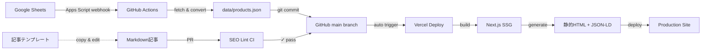

# アフィリエイトサイト アーキテクチャ設計（改訂版）

**最終更新**: 2025-10-27
**ステータス**: Design Phase
**レビュー**: Codex Review Pending

---

## 目次

1. [設計思想](#設計思想)
2. [技術スタック](#技術スタック)
3. [データフロー](#データフロー)
4. [SEO戦略](#seo戦略)
5. [運用フロー](#運用フロー)
6. [リスク管理](#リスク管理)
7. [改善点の反映](#改善点の反映)

---

## 設計思想

### コアコンセプト

**データ駆動 × テンプレート化 × 自動ガードレール**

```
エンジニア      → 初期構築 + CI/CD ガードレール（一度だけ）
非エンジニア    → データ更新 + 記事追加（継続的）
自動化          → デプロイ + SEOチェック + レポート
```

### 設計原則

1. **役割分担の明確化**: 技術者と運用者の境界を明示
2. **データ駆動**: 比較表はコードではなくデータで管理
3. **テンプレート化**: 記事構造を型化してSEO品質を担保
4. **自動ガードレール**: CIで品質チェック、人的ミスを防ぐ
5. **段階的実装**: 5段階で機能を積み上げ（IMPLEMENTATION_PLAN.md参照）

---

## 技術スタック

### フロントエンド・基盤

| 技術                        | 役割           | 選定理由                                                                           |
| --------------------------- | -------------- | ---------------------------------------------------------------------------------- |
| **Next.js 15 (App Router)** | フレームワーク | PPR（部分的プリレンダリング）でSEO最適、画像最適化、自動サイトマップ、React 19対応 |
| **TypeScript**              | 型安全性       | データスキーマの整合性担保                                                         |
| **Tailwind CSS**            | スタイリング   | 高速開発、パフォーマンス最適                                                       |
| **Vercel**                  | ホスティング   | 自動デプロイ、Edge対応、Analytics標準                                              |

### データ管理

| 技術                   | 役割           | 実装詳細                                 |
| ---------------------- | -------------- | ---------------------------------------- |
| **Google Sheets**      | データソース   | 比較表（価格・返金・日本対応etc.）を管理 |
| **Google Apps Script** | 自動化トリガー | onEdit → Webhook → GitHub Actions起動    |
| **GitHub Actions**     | CI/CD          | シート取得 → JSON変換 → commit → deploy  |
| **Zod**                | スキーマ検証   | シートデータの型チェック（ビルド時）     |

### コンテンツ管理

| 技術                | 役割            | 実装詳細                                   |
| ------------------- | --------------- | ------------------------------------------ |
| **Markdown**        | 記事形式        | frontmatter + 本文（GitHub上で直接編集可） |
| **gray-matter**     | frontmatter解析 | メタデータ抽出                             |
| **remark/rehype**   | Markdown処理    | HTML変換、目次生成、画像最適化             |
| **next-mdx-remote** | MDX対応         | 動的コンポーネント埋め込み（比較表など）   |

### SEO・構造化データ

| 技術              | 役割                 | 実装詳細                     |
| ----------------- | -------------------- | ---------------------------- |
| **next-sitemap**  | サイトマップ自動生成 | ビルド時に全ページを収集     |
| **next-seo**      | メタタグ管理         | canonical、OGP、Twitter Card |
| **JSON-LD**       | 構造化データ         | FAQ、HowTo、Article スキーマ |
| **Lighthouse CI** | パフォーマンス計測   | PR時にスコア変化を表示       |

### 品質管理

| 技術                  | 役割         | 実装詳細                              |
| --------------------- | ------------ | ------------------------------------- |
| **markdownlint**      | Markdown品質 | 見出し階層、リンク切れチェック        |
| **カスタムSEOリント** | SEO品質      | タイトル文字数、FAQの有無など（後述） |
| **Prettier**          | フォーマット | コード整形                            |
| **ESLint**            | 静的解析     | Next.js推奨ルール                     |

---

## データフロー

### 全体像



### データ更新フロー（詳細）

#### 1. Googleシート編集

**シート構成**（`products` シート）

| 列名            | 型      | 必須 | 説明                 | 例              |
| --------------- | ------- | ---- | -------------------- | --------------- |
| `id`            | string  | ✓    | 一意ID               | `surfshark-vpn` |
| `name`          | string  | ✓    | 商品名               | `Surfshark VPN` |
| `price_monthly` | number  | ✓    | 月額価格（USD）      | `12.95`         |
| `price_annual`  | number  | ✓    | 年額価格（USD）      | `47.88`         |
| `refund_days`   | number  | ✓    | 返金保証日数         | `30`            |
| `japan_ui`      | boolean | ✓    | 日本語UI             | `TRUE`          |
| `japan_payment` | boolean | ✓    | 日本の決済対応       | `TRUE`          |
| `japan_support` | boolean | ✓    | 日本語サポート       | `FALSE`         |
| `japan_docs`    | boolean | ✓    | 日本語ドキュメント   | `TRUE`          |
| `affiliate_url` | string  | ✓    | アフィリエイトリンク | `https://...`   |
| `last_updated`  | date    | ✓    | 最終確認日           | `2025-10-27`    |
| `source_url`    | string  | ✓    | 出典URL（公式）      | `https://...`   |

**スコアリング計算**（自動列）

```
= japan_score (0-4点)
= COUNTIF(japan_ui, japan_payment, japan_support, japan_docs, TRUE)
```

#### 2. 自動同期（Apps Script → GitHub Actions）

**Apps Script** (`onEdit` トリガー + デバウンス)

```javascript
// グローバル変数で最終更新時刻を管理
const DEBOUNCE_MS = 60000; // 1分間のデバウンス

function onEdit(e) {
  const sheet = e.source.getActiveSheet();
  if (sheet.getName() !== 'products') return;

  // LockServiceで連続編集を制御
  const lock = LockService.getScriptLock();
  if (!lock.tryLock(1000)) {
    Logger.log('別の更新処理が実行中のためスキップ');
    return;
  }

  try {
    const scriptProps = PropertiesService.getScriptProperties();
    const lastTrigger = scriptProps.getProperty('LAST_TRIGGER_TIME');
    const now = Date.now();

    // デバウンス: 前回から1分以内なら発火しない
    if (lastTrigger && now - parseInt(lastTrigger) < DEBOUNCE_MS) {
      Logger.log('デバウンス期間中のためスキップ');
      return;
    }

    // GitHub repository_dispatch を呼び出し
    const url = 'https://api.github.com/repos/{owner}/{repo}/dispatches';
    const payload = {
      event_type: 'sheet_updated',
      client_payload: {
        timestamp: new Date().toISOString(),
        editor: Session.getActiveUser().getEmail(),
      },
    };

    const response = UrlFetchApp.fetch(url, {
      method: 'post',
      headers: {
        Authorization: 'Bearer ' + scriptProps.getProperty('GITHUB_TOKEN'),
        Accept: 'application/vnd.github+json',
        'User-Agent': 'Google-Apps-Script',
        'X-GitHub-Api-Version': '2022-11-28',
      },
      contentType: 'application/json',
      payload: JSON.stringify(payload),
      muteHttpExceptions: true,
    });

    if (response.getResponseCode() === 204) {
      scriptProps.setProperty('LAST_TRIGGER_TIME', now.toString());
      Logger.log('GitHub Actions トリガー成功');
    } else {
      Logger.log('エラー: ' + response.getContentText());
    }
  } finally {
    lock.releaseLock();
  }
}
```

**セキュリティ注意**:

- `GITHUB_TOKEN` は Fine-grained PAT で `contents: write` + `metadata: read` のみ付与
- Apps Script の編集権限は管理者のみに制限（閲覧者には不可視）
- トークンは PropertiesService（暗号化ストレージ）に保存

**GitHub Actions** (`.github/workflows/sync-sheet.yml`)

```yaml
name: Sync Google Sheets
on:
  repository_dispatch:
    types: [sheet_updated]
  schedule:
    - cron: '0 */6 * * *' # フォールバック：6時間ごと

# 同時実行を防ぐ（前回のジョブが完了するまで待機）
concurrency:
  group: sync-sheet
  cancel-in-progress: false

jobs:
  sync:
    runs-on: ubuntu-latest
    permissions:
      contents: write # git push に必要
    steps:
      - uses: actions/checkout@v4
        with:
          persist-credentials: true

      - uses: actions/setup-node@v4
        with:
          node-version: '20'

      - name: Install dependencies
        run: npm ci

      - name: Fetch Google Sheets
        run: node scripts/fetch-sheet.js
        env:
          GOOGLE_SERVICE_ACCOUNT_KEY: ${{ secrets.GOOGLE_SERVICE_ACCOUNT_KEY }}
          GOOGLE_SHEETS_ID: ${{ secrets.GOOGLE_SHEETS_ID }}

      - name: Validate Data
        run: node scripts/validate-data.js

      - name: Commit if changed
        run: |
          git config user.name "github-actions[bot]"
          git config user.email "github-actions[bot]@users.noreply.github.com"
          git config pull.ff only
          git add data/products.json
          if ! git diff --staged --quiet; then
            git commit -m "chore: update products data [skip ci]

            Updated by: ${{ github.event.client_payload.editor || 'scheduled job' }}
            Timestamp: ${{ github.event.client_payload.timestamp || github.event.repository.updated_at }}"
            git pull --rebase
            git push
          else
            echo "No changes detected"
          fi
```

**データ変換スクリプト** (`scripts/fetch-sheet.js`)

```javascript
import { google } from 'googleapis';
import { z } from 'zod';
import fs from 'fs';

// Zodスキーマ定義
const ProductSchema = z.object({
  id: z.string().regex(/^[a-z0-9-]+$/),
  name: z.string().min(1),
  price_monthly: z.number().positive(),
  price_annual: z.number().positive(),
  refund_days: z.number().int().nonnegative(),
  japan_ui: z.boolean(),
  japan_payment: z.boolean(),
  japan_support: z.boolean(),
  japan_docs: z.boolean(),
  affiliate_url: z.string().url(),
  last_updated: z.string().regex(/^\d{4}-\d{2}-\d{2}$/),
  source_url: z.string().url(),
});

// サービスアカウント認証（非公開シート対応）
const auth = new google.auth.GoogleAuth({
  credentials: JSON.parse(process.env.GOOGLE_SERVICE_ACCOUNT_KEY),
  scopes: ['https://www.googleapis.com/auth/spreadsheets.readonly'],
});

const sheets = google.sheets({ version: 'v4', auth });

try {
  // シートデータ取得
  const response = await sheets.spreadsheets.values.get({
    spreadsheetId: process.env.GOOGLE_SHEETS_ID,
    range: 'products!A2:M', // ヘッダー行を除く
    valueRenderOption: 'UNFORMATTED_VALUE', // 型情報を保持
  });

  if (!response.data.values || response.data.values.length === 0) {
    console.warn('警告: シートにデータがありません');
    process.exit(0);
  }

  // 行をオブジェクトに変換
  const products = response.data.values.map((row, index) => {
    try {
      return {
        id: row[0]?.toString().trim() || '',
        name: row[1]?.toString().trim() || '',
        price_monthly: parseFloat(row[2]) || 0,
        price_annual: parseFloat(row[3]) || 0,
        refund_days: parseInt(row[4]) || 0,
        japan_ui: row[5] === true || row[5] === 'TRUE',
        japan_payment: row[6] === true || row[6] === 'TRUE',
        japan_support: row[7] === true || row[7] === 'TRUE',
        japan_docs: row[8] === true || row[8] === 'TRUE',
        affiliate_url: row[9]?.toString().trim() || '',
        last_updated: row[10]?.toString().trim() || '',
        source_url: row[11]?.toString().trim() || '',
      };
    } catch (err) {
      console.error(`行 ${index + 2} の解析エラー:`, err.message);
      throw err;
    }
  });

  // Zodでバリデーション
  const validated = z.array(ProductSchema).parse(products);

  // 日本対応スコアでソート（高い順）
  validated.sort((a, b) => {
    const scoreA = [
      a.japan_ui,
      a.japan_payment,
      a.japan_support,
      a.japan_docs,
    ].filter(Boolean).length;
    const scoreB = [
      b.japan_ui,
      b.japan_payment,
      b.japan_support,
      b.japan_docs,
    ].filter(Boolean).length;
    return scoreB - scoreA;
  });

  // JSON出力
  fs.writeFileSync('data/products.json', JSON.stringify(validated, null, 2));
  console.log(`✓ ${validated.length}件の商品データを取得しました`);
} catch (error) {
  console.error('エラー:', error.message);
  if (error.errors) {
    console.error(
      'バリデーションエラー:',
      JSON.stringify(error.errors, null, 2)
    );
  }
  process.exit(1);
}
```

**重要な変更点**:

- ✅ サービスアカウント認証（非公開シート対応）
- ✅ 詳細なZodスキーマ（型と形式をチェック）
- ✅ エラーハンドリング（行番号付き）
- ✅ 自動ソート（日本対応スコア順）

#### 3. ビルド時の利用

```typescript
// app/compare/page.tsx
import products from '@/data/products.json';

export default function ComparePage() {
  // 日本対応スコアでソート
  const sorted = products.sort((a, b) =>
    (b.japan_ui + b.japan_payment + b.japan_support + b.japan_docs) -
    (a.japan_ui + a.japan_payment + a.japan_support + a.japan_docs)
  );

  return <ComparisonTable products={sorted} />;
}
```

---

## SEO戦略

### BOFU設計（購入直前ユーザー向け）

#### ページ構造テンプレート

```markdown
# タイトル（30-60文字、キーワード前方配置）

## 結論ボックス（上部固定）

- **最安値**: {product} - ${price}/月
- **返金保証**: 最長{days}日間
- **日本対応度**: ⭐⭐⭐⭐☆ (4/5)
- 👉 [公式サイトで最新価格を確認](#)

## 比較表（動的生成）

{products.json から自動生成}

## 詳細レビュー

### {商品名1}

#### 良い点

#### 悪い点

#### 返金・解約方法（先出し）

## FAQ（構造化データ）

### Q1: ...

### Q2: ...

## 関連記事（内部リンク）

- [詳細レビュー] ← 個別商品ページ
- [使い方ガイド] ← HowTo記事
```

### SEOリント（CI自動チェック）

**チェック項目** (`scripts/seo-lint.js`)

```javascript
const rules = {
  // メタデータ
  titleLength: { min: 30, max: 60 },
  descriptionLength: { min: 120, max: 160 },

  // 見出し構造
  h1Count: { exact: 1 },
  h2MinCount: { min: 3 },
  headingHierarchy: true, // H2→H3→H4 の順序

  // コンテンツ
  minWordCount: 1500,
  maxWordCount: 5000,

  // 必須セクション
  requiredSections: ['返金', '解約', 'FAQ', '比較'],

  // リンク
  internalLinksMin: 3,
  externalLinksMin: 2,
  brokenLinks: false,

  // 画像
  allImagesHaveAlt: true,
  imageFormat: ['webp', 'jpg', 'png'],

  // 構造化データ
  jsonLdExists: true,
  jsonLdValid: true,
  faqSchemaExists: true,
};
```

**CI統合** (`.github/workflows/seo-check.yml`)

```yaml
name: SEO Quality Check
on: [pull_request]

jobs:
  lint:
    runs-on: ubuntu-latest
    steps:
      - uses: actions/checkout@v4
      - run: npm ci
      - run: npm run seo-lint
      - run: npm run build # Zodバリデーション含む

      - name: Lighthouse CI
        uses: treosh/lighthouse-ci-action@v10
        with:
          urls: |
            http://localhost:3000
            http://localhost:3000/compare
          uploadArtifacts: true
```

### 構造化データ実装

**FAQ Schema** (`components/faq-schema.tsx`)

```typescript
export function FAQSchema({ items }: { items: Array<{ q: string; a: string }> }) {
  const schema = {
    "@context": "https://schema.org",
    "@type": "FAQPage",
    "mainEntity": items.map(item => ({
      "@type": "Question",
      "name": item.q,
      "acceptedAnswer": {
        "@type": "Answer",
        "text": item.a
      }
    }))
  };

  return (
    <script
      type="application/ld+json"
      dangerouslySetInnerHTML={{ __html: JSON.stringify(schema) }}
    />
  );
}
```

**Article Schema** (自動生成)

```typescript
// app/review/[slug]/page.tsx
export function generateMetadata({ params }) {
  const article = getArticle(params.slug);

  return {
    title: article.title,
    description: article.description,
    alternates: {
      canonical: `https://example.com/review/${params.slug}`
    },
    openGraph: { /* ... */ },
    other: {
      'article:published_time': article.publishedAt,
      'article:modified_time': article.updatedAt
    }
  };
}

export default function ArticlePage({ params }) {
  const schema = {
    "@context": "https://schema.org",
    "@type": "Article",
    "headline": article.title,
    "datePublished": article.publishedAt,
    "dateModified": article.updatedAt,
    "author": { "@type": "Organization", "name": "Site Name" }
  };

  return (
    <>
      <script type="application/ld+json" dangerouslySetInnerHTML={{ __html: JSON.stringify(schema) }} />
      {/* 記事本文 */}
    </>
  );
}
```

---

## 運用フロー

### A. 比較表更新（最速パス）

**所要時間**: 5分

1. Googleシートを開く
2. 価格・返金日数などを編集
3. 自動保存 → Apps Script が webhook 発火（裏で動作）
4. 5分後、Vercel Dashboard でデプロイ完了を確認
5. プレビューURLで変更箇所を確認（チェックリスト参照）
6. Production に promote

**チェックリスト** (PRコメントに自動表示)

- [ ] 価格表示が正しいか
- [ ] 返金日数が正しいか
- [ ] 日本対応スコアが更新されているか
- [ ] アフィリエイトリンクが機能するか
- [ ] 最終確認日が今日の日付か

### B. 記事追加（テンプレ利用）

**所要時間**: 30分（執筆除く）

1. テンプレートをコピー

   ```bash
   cp templates/review.md content/review/new-product.md
   ```

2. Frontmatter を編集

   ```yaml
   ---
   title: '【2025年最新】{商品名}の評判・レビュー'
   description: '{商品名}の実際の使用感、料金、返金方法を徹底解説...'
   publishedAt: '2025-10-27'
   updatedAt: '2025-10-27'
   category: 'review'
   productId: 'product-id' # products.json の id
   keywords: ['商品名', 'レビュー', '評判']
   ---
   ```

3. 本文を執筆（テンプレートの `` を埋める）

4. PR作成

   ```bash
   git checkout -b article/new-product
   git add content/review/new-product.md
   git commit -m "feat: add review for new product"
   git push origin article/new-product
   gh pr create --title "新規記事: {商品名}レビュー" --body "$(cat .github/PULL_REQUEST_TEMPLATE.md)"
   ```

5. CI が SEOリント実行 → 結果を確認

6. 修正 → 再プッシュ → ✓ → マージ

### C. 週次メンテナンス

**毎週月曜 10:00** (GitHub Actions 自動実行)

1. **EPC × 日本対応スコア 棚卸し**
   - ASPの管理画面からEPCデータ取得（手動）
   - `data/epc.json` に追記
   - Actions が自動で「推奨商品」順位を更新

2. **リンク切れチェック**

   ```bash
   npm run check-links
   ```

3. **画像最適化**
   - 新規追加画像を自動で WebP 変換
   - Cloudinary or Vercel Image Optimization

4. **レポート生成**
   - GA4データ取得（上位10記事のPV・CVR）
   - Slack通知

---

## リスク管理

### 1. 法的リスク対策

#### A. 免責文言（全ページフッター）

```html
<footer>
  <p class="text-xs text-gray-500">
    ※ 価格・返金条件は{最終確認日}時点の情報です。最新情報は
    <a href="{公式URL}" class="underline">公式サイト</a>でご確認ください。
    当サイトはアフィリエイトプログラムに参加しており、
    紹介リンクから購入された場合に報酬を得ることがあります。
  </p>
</footer>
```

#### B. 最終確認日の表示（比較表内）

```tsx
<TableCell>
  ${product.price_monthly}/月
  <span className="text-xs text-gray-400 block">
    確認日: {product.last_updated}
  </span>
</TableCell>
```

#### C. アフィリエイトリンクの適切な開示

**公式サイトリンク**（情報確認用）

```tsx
<a
  href={product.source_url}
  target="_blank"
  rel="noopener noreferrer"
  className="text-blue-600 underline"
>
  公式サイトで最新情報を確認
</a>
```

**アフィリエイトリンク**（購入導線）

```tsx
<a
  href={product.affiliate_url}
  target="_blank"
  rel="sponsored nofollow noopener"
  className="btn btn-primary"
>
  {product.name}を見る
  <span className="text-xs ml-2">(PR)</span>
</a>
```

**重要**:

- ✅ `rel="sponsored"`: アフィリエイトリンクであることを検索エンジンに通知（Google推奨）
- ✅ `rel="nofollow"`: PageRankを渡さない（古い慣習だが併用が安全）
- ✅ `(PR)` 表記: ユーザーに広告であることを明示（薬機法・景表法対策）

### 2. データ整合性

#### A. Zodスキーマバリデーション（ビルド時）

```typescript
// scripts/validate-data.js
import { z } from 'zod';
import fs from 'fs';

// fetch-sheet.jsと同じスキーマを使用（DRY原則）
const ProductSchema = z.object({
  id: z.string().regex(/^[a-z0-9-]+$/),
  name: z.string().min(1),
  price_monthly: z.number().positive(),
  price_annual: z.number().positive(),
  refund_days: z.number().int().nonnegative(),
  japan_ui: z.boolean(),
  japan_payment: z.boolean(),
  japan_support: z.boolean(),
  japan_docs: z.boolean(),
  affiliate_url: z.string().url(),
  last_updated: z.string().regex(/^\d{4}-\d{2}-\d{2}$/), // YYYY-MM-DD形式
  source_url: z.string().url(),
});

try {
  const products = JSON.parse(fs.readFileSync('data/products.json', 'utf-8'));
  z.array(ProductSchema).parse(products);
  console.log(`✓ Data validation passed (${products.length} products)`);
} catch (error) {
  console.error('✗ Data validation failed:', error.message);
  if (error.errors) {
    console.error('Details:', JSON.stringify(error.errors, null, 2));
  }
  process.exit(1);
}
```

**重要**: このスキーマは `scripts/fetch-sheet.js` と完全に一致させること。
将来的には `lib/schema.ts` に共通スキーマを定義し、両方のスクリプトでインポートすることを推奨。

#### B. 価格変動アラート

```yaml
# .github/workflows/price-alert.yml
- name: Check Price Changes
  run: |
    git diff HEAD~1 data/products.json | grep price_monthly && \
    curl -X POST ${{ secrets.SLACK_WEBHOOK }} \
      -d '{"text": "価格が更新されました。記事の修正が必要な可能性があります。"}'
```

### 3. 日本対応フラグの基準

#### 明確な判定基準

| フラグ          | 条件                          | 確認方法                       |
| --------------- | ----------------------------- | ------------------------------ |
| `japan_ui`      | 管理画面・サイトが日本語表示  | ログイン後のスクリーンショット |
| `japan_payment` | JCB/コンビニ/PayPay等が利用可 | 決済画面のスクリーンショット   |
| `japan_support` | 日本語チャット or メール対応  | サポート問い合わせの返信       |
| `japan_docs`    | ヘルプセンターが日本語        | ドキュメントURLの言語確認      |

#### スコアリングロジック

```typescript
function calculateJapanScore(product: Product): number {
  return [
    product.japan_ui,
    product.japan_payment,
    product.japan_support,
    product.japan_docs,
  ].filter(Boolean).length;
}

// 表示時のフィルタリング
const japanFriendly = products.filter((p) => calculateJapanScore(p) >= 3);
```

### 4. パフォーマンス監視

#### Lighthouse CI の閾値

```json
{
  "ci": {
    "assert": {
      "assertions": {
        "categories:performance": ["error", { "minScore": 0.9 }],
        "categories:accessibility": ["error", { "minScore": 0.9 }],
        "categories:seo": ["error", { "minScore": 0.95 }],
        "first-contentful-paint": ["error", { "maxNumericValue": 2000 }],
        "largest-contentful-paint": ["error", { "maxNumericValue": 2500 }]
      }
    }
  }
}
```

---

## 改善点の反映

### Critical修正（初期レビュー対応）

| #   | 指摘                     | 対応内容                                      | ドキュメント参照              |
| --- | ------------------------ | --------------------------------------------- | ----------------------------- |
| 1   | Googleシート自動化が曖昧 | Apps Script + GitHub Actions の具体実装を明記 | [データフロー](#データフロー) |
| 2   | 法的リスク対策が不足     | 免責文言、最終確認日、公式リンク誘導を標準化  | [リスク管理](#リスク管理)     |
| 3   | SEOリントの定義が不明確  | 14項目の具体的チェック内容を列挙              | [SEO戦略](#seo戦略)           |

### Important修正

| #   | 指摘                       | 対応内容                               | ドキュメント参照          |
| --- | -------------------------- | -------------------------------------- | ------------------------- |
| 4   | ABテストの仕組みが未定義   | Stage 5 で Vercel Edge Config 実装予定 | IMPLEMENTATION_PLAN.md    |
| 5   | コンテンツ履歴管理が弱い   | PRテンプレート + 月次レポート自動生成  | [運用フロー](#運用フロー) |
| 6   | 日本対応フラグの基準が曖昧 | 4項目の明確な判定基準とスコアリング    | [リスク管理](#リスク管理) |

### Nice to Have（Stage 5以降）

- Lighthouse CI スコアのPR表示
- VSCode snippets for article templates
- 画像の自動WebP変換

---

## Next Steps

1. **Codex レビュー**: このドキュメントの技術的妥当性を検証
2. **IMPLEMENTATION_PLAN.md 作成**: 5段階の詳細計画
3. **プロトタイプ構築**: Stage 1-2 の実装開始

---

## 参考資料

- [Next.js App Router Docs](https://nextjs.org/docs/app)
- [Google Sheets API](https://developers.google.com/sheets/api/guides/concepts)
- [Schema.org FAQ](https://schema.org/FAQPage)
- [Core Web Vitals](https://web.dev/vitals/)
